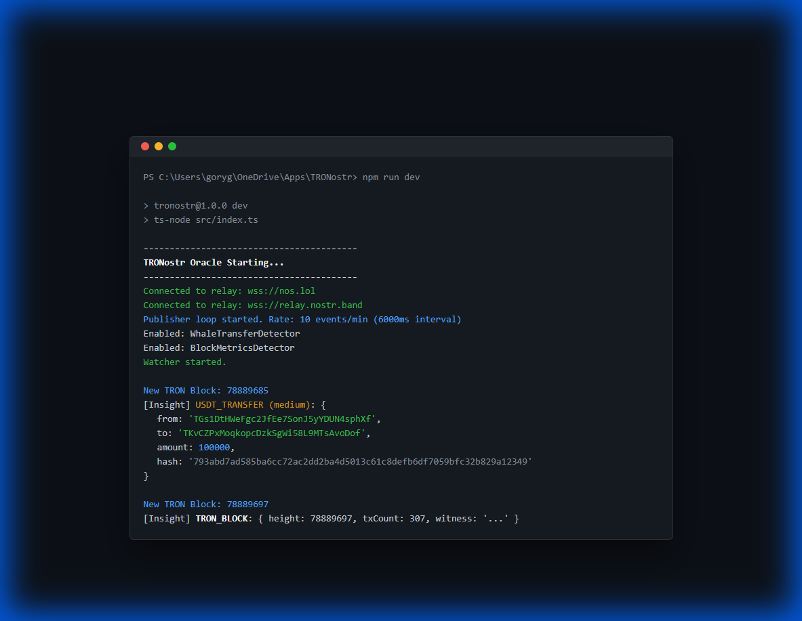

# TRONostr 🚀



TRONostr is a high-performance, open-source oracle daemon that turns raw **TRON** blockchain activity into real-time, signed **Nostr** events.

> [!IMPORTANT]
> **Built for Developers, Bots, and Social Apps.** TRONostr provides a lightweight, unified bridge that allows any application—from AI-powered trading bots to social dashboards—to consume TRON intelligence in minutes without running heavy TRON infrastructure.

## Key Features

- **Instant Integration**: Plug TRON data directly into **Nostr social clients, Discord bots, and Telegram alerts**.
- **TRON Watcher**: Real-time streaming of blocks and transactions using high-performance `TronWeb` polling.
- **Modular Detector Engine**: 
  - `WhaleTransferDetector`: Instant alerts for significant TRX and USDT movements.
  - `BlockMetricsDetector`: Live health and throughput metrics for the TRON network.
- **Developer-First SDK**: A lightweight TypeScript client to get you started in seconds.
- **Reliable Publishing**: Signed events with built-in publication throttling to ensure stability across global Nostr relays.

## Quick Start

### 1. Prerequisites
- Node.js (v16+)
- A Nostr Private Key (Hex format)
- [Optional] TronGrid API Key for higher rate limits.

### 2. Installation
```bash
npm install
```

### 3. Configuration
Copy the environment template and add your keys:
```bash
cp .env.example .env
```
Edit `config.yaml` to customize thresholds and relays.

### 4. Run the Oracle
```bash
# Development mode
npm run dev

# Production build & run
npm run start
```

## Data Model

TRONostr publishes events in the `6500-6599` kind range (default):
- **Kind 6500**: Block Metrics (`TRON_BLOCK`)
- **Kind 6501**: TRX Transfers (`TRX_TRANSFER`)
- **Kind 6502**: USDT Transfers (`USDT_TRANSFER`)

Each event is tagged with `["chain", "tron"]` and relevant metadata for efficient filtering.

## Client Integration (SDK)

It’s easy to integrate TRONostr into your own apps or bots using our built-in `TRONostrClient`.

### Installation
If you are using this as a library:
```bash
npm install tronweb nostr-tools ws
```

### Usage
```typescript
import { TRONostrClient } from './src/Client';

const client = new TRONostrClient({
  relays: ["wss://nos.lol"]
});

await client.connect();

// Listen for whale transfers
client.onTransfer((event) => {
  console.log("Whale Alert:", event.parsedContent.amount);
});

// Listen for block metrics
client.onBlock((event) => {
  console.log("New Block:", event.parsedContent.height);
});
```

See `examples/bot_example.ts` for a full implementation.

## License

Permissive MIT/Apache license. Built for the TRON and Nostr communities.
