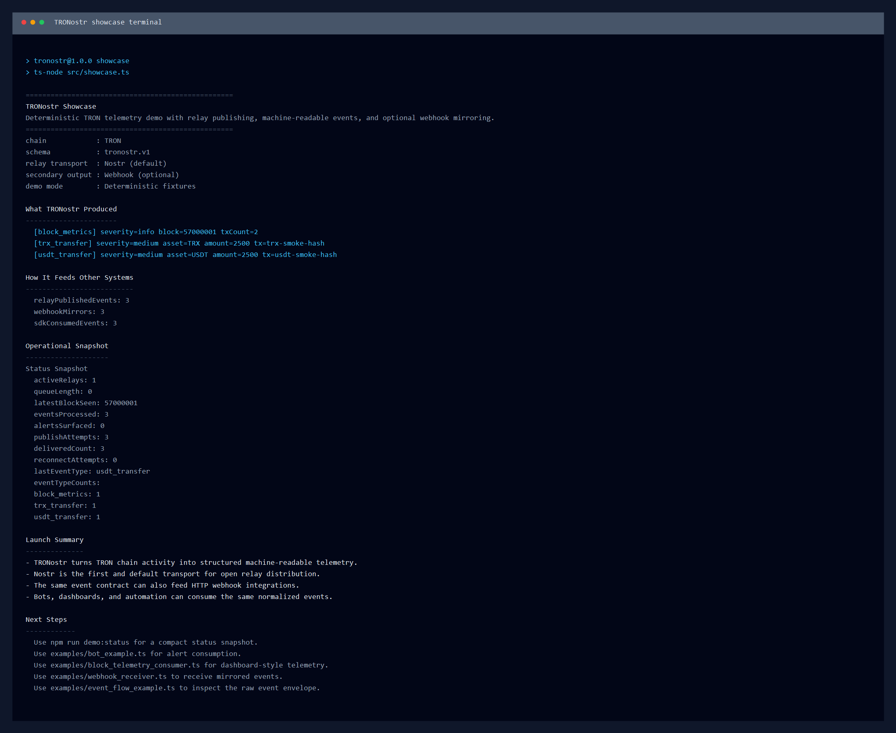

# TRONostr


TRONostr is open realtime TRON telemetry infrastructure. It watches TRON activity, turns raw chain data into structured machine-readable events, and distributes those events over Nostr as the first/default transport, with optional webhook mirroring for secondary delivery.

Builders can use it to feed bots, dashboards, alerting pipelines, and automation that need clean TRON signals without running a custom TRON ingestion stack.

## Who It's For

- teams building TRON bots or alerting systems
- dashboards that need block and transfer telemetry
- services that want machine-readable TRON events over relays or webhooks
- ecosystem teams evaluating reusable TRON infrastructure primitives

## Why This Matters

TRON activity is easy to query badly and expensive to normalize repeatedly. TRONostr already ships the practical pieces most downstream systems need:

- stable event kinds and a shared schema
- runtime validation at publish and consume boundaries
- relay distribution over Nostr
- optional webhook mirroring
- deterministic local showcase and smoke paths

## Architecture

TRONostr is split into five small layers:

1. `Watcher`
   Polls TRON blocks and transactions with backoff, jitter, and optional checkpoint restore.
2. `Detectors`
   Convert raw TRON activity into structured insights such as `block_metrics`, `trx_transfer`, and `usdt_transfer`.
3. `Publisher`
   Signs and publishes validated TRONostr events to configured Nostr relays.
4. `Optional outputs`
   Mirror the same event envelope to secondary sinks such as webhooks.
5. `TRONostrClient`
   Subscribes by deterministic kinds and validates/parses repo-native JSON client-side.

```text
TRON node / TronGrid
        |
        v
     Watcher
        |
        v
    Detectors
        |
        v
  structured events
        |
        v
 Publisher / outputs
        |
        v
 relays / webhook sinks
        |
        v
 bots / dashboards / agents / services
```

Stable kind mapping:

- `6500`: `block_metrics`
- `6501`: `trx_transfer`
- `6502`: `usdt_transfer`

Schema version:

- `tronostr.v1`

Core event fields:

- `schema`
- `chain`
- `category`
- `eventType`
- `asset`
- `severity`
- `source.detector`
- `block`
- `transaction`
- `data`

## Best Quickstart

If you want the fastest way to understand the product, run the deterministic showcase:

```bash
npm install
npm run showcase
```

`npm run showcase` is the clearest first-run path. It shows:

- what TRONostr produces
- what the machine-readable events look like
- how those events can feed relays, SDK consumers, and webhook sinks
- what runtime stats are available

Actual `npm run showcase` terminal output:



Other useful local commands:

```bash
npm run demo:status
npm run smoke
```

## SDK / Integration Surface

The public package surface is intended to be directly usable:

- `TRONostrClient`
- `Publisher`
- `Watcher`
- `TRONostrRuntime`
- `TRONostrStatusTracker`
- `WebhookOutput`
- `prepareTRONostrEvent()`

Package subpath exports:

- `tronostr`
- `tronostr/schema`
- `tronostr/runtime`
- `tronostr/status`
- `tronostr/output`

Basic consumer example:

```ts
import { TRONostrClient } from 'tronostr';

const client = new TRONostrClient({
  relays: ['wss://nos.lol', 'wss://relay.damus.io'],
});

await client.connect();

client.onBlock((event) => {
  console.log(event.parsedContent.block?.height, event.parsedContent.data.txCount);
});

client.onTransfer((event) => {
  console.log(event.parsedContent.asset, event.parsedContent.data.amount);
});

client.onAlerts((event) => {
  console.log(event.parsedContent.severity, event.parsedContent.eventType);
});
```

Publisher stats include:

- `queueLength`
- `activeRelayCount`
- `publishAttempts`
- `deliveredCount`
- `reconnectAttempts`
- `disconnectCount`

Client stats include:

- `activeRelayCount`
- `configuredRelayCount`

## Integration Value

TRONostr is already usable in a few concrete integration patterns:

- bots
  Consume `onAlerts()`, `onTRXTransfer()`, or `onUSDTTransfer()` and react to normalized transfer events.
- dashboards
  Consume `onBlock()` and `onTransfer()` for block-level and transfer-level telemetry without parsing raw TRON payloads.
- alerting systems
  Use relay subscriptions or mirrored webhook events to route machine-readable alerts into existing pipelines.
- automated workflows
  Use the shared event schema as a trigger contract for services that need deterministic TRON event types and payloads.

## Optional Webhook Output

Nostr is still the first and default transport in this repo.

TRONostr can also mirror the same repo-native envelope to an HTTP webhook:

```yaml
output:
  webhook:
    enabled: true
    url: "http://127.0.0.1:8787/tronostr"
    timeoutMs: 5000
```

Webhook payload shape:

```json
{
  "transport": "webhook",
  "kind": 6502,
  "created_at": 1710000000,
  "tags": [["t", "tron"]],
  "event": {
    "schema": "tronostr.v1",
    "chain": "tron",
    "category": "transfer",
    "eventType": "usdt_transfer",
    "severity": "high",
    "source": { "detector": "WhaleTransferDetector" },
    "transaction": { "hash": "..." },
    "data": { "amount": 2500000 }
  }
}
```

## Example Use Cases

TRONostr is aimed at:

- whale and risk alerting
- stablecoin movement monitoring
- block telemetry for dashboards
- machine-readable triggers for bots and automation
- lightweight event distribution for autonomous finance systems

Repo examples:

- `examples/bot_example.ts`
- `examples/block_telemetry_consumer.ts`
- `examples/webhook_receiver.ts`
- `examples/event_flow_example.ts`
- `examples/README.md`

## Running Live

Set `NOSTR_PRIVATE_KEY` in `.env`, then run:

```bash
npm run build
npm run start
```

Useful live/runtime commands:

```bash
npm run dev
npm run demo:status -- --live
npm run verify:tron
npm run verify:relays
```

Operational characteristics:

- watcher polling uses bounded backoff and jitter
- relay connections use explicit reconnect policy
- publisher exposes queue/runtime stats via `getStats()`
- optional file-backed checkpoint persistence can resume from the last processed block
- webhook output is optional and secondary; Nostr remains the default and first transport

## Testing / Verification

Deterministic local proof path:

```bash
npm test
npm run smoke
npm run showcase
npm run demo:status
```

These cover:

- detectors
- schema validation
- publisher behavior
- client behavior
- reconnect/stats/checkpoint behavior
- prepared event envelopes
- status tracking
- webhook delivery

Optional live verification:

```bash
npm run verify:tron
npm run verify:relays
```

Those commands depend on real network access and should be treated as additive live checks, not the default proof path.

## Launch Assets

Small launch-facing text assets are included in `launch`:

- `launch/ABOUT_BLURB.md`
- `launch/PITCH.md`
- `launch/WHAT_TRONOSTR_IS.md`
- `launch/THREAD_DRAFT.md`
- `launch/SHOWCASE_WALKTHROUGH.md`

## Roadmap

- add more TRON-native detectors
- support more secondary transports alongside Nostr
- improve replay/demo tooling
- keep sharpening the SDK surface for bots, dashboards, and automation
